# Copilot Enterprise Workshop Orchestrator

### Deterministic Azure Landing Zone Governance — Multi-Turn, Tool-Restricted, Enterprise Guardrailed

This project implements a GitHub Copilot SDK–powered **enterprise workshop orchestrator** over a deterministic Azure Landing Zone (ALZ) governance engine.

> **Copilot does not score controls.**
> **Copilot does not mutate the environment.**

Copilot acts as a multi-turn orchestration layer, selecting from explicit, guardrailed tools that execute deterministic governance logic and return structured, traceable evidence.

---

## What Makes This Enterprise-Grade

- **One-way data flow:** deterministic → AI
- **Tool-restricted execution surface**
- **No scoring modification**
- **No environment mutation**
- **No file writes outside `out/`**
- **Structured output validation**
- **Microsoft Learn grounding via MCP**

> **This is not a chatbot.**
>
> It is a controlled governance orchestration layer over live Azure telemetry.

---

## Deterministic Reasoning Foundation

The underlying assessment engine performs structured, multi-stage reasoning over live Azure telemetry:

1. Deterministic control evaluation
2. Dependency graph impact analysis
3. Initiative ordering based on structural constraints
4. Causal "why-risk" chain construction
5. Microsoft Learn–grounded remediation guidance

**The AI does not score. It reasons over scored evidence.**

### What the Engine Produces

- Scores every control in the [Azure Landing Zone Review Checklist](https://github.com/Azure/review-checklists) against live Azure telemetry
- Builds a dependency-ordered 30-60-90 transformation roadmap
- Performs causal "why-risk" analysis across domains
- Grounds remediation in official Microsoft Learn documentation

---

## Built for Cloud Solution Architects

Designed for CSA-led enterprise engagements, this system replaces slideware and checklist interviews with deterministic telemetry analysis.

**Run one command → enter a Copilot-facilitated workshop session over scored governance evidence.**

> [!IMPORTANT]
> 🔍 **Open the interactive demo report:**
> 👉 **[View the HTML assessment report](https://htmlpreview.github.io/?https://github.com/rebmid/Copilot-alz-workshop-orchestrator/blob/main/docs/demo/Contoso-ALZ-Platform-Readiness-Report-Sample.html)**
>
> Generated from a real Azure Test/Lab "Contoso" tenant using read-only access.

---
## Demo Walkthrough – Copilot-Orchestrated ALZ Workshop

The live workshop session below demonstrates Copilot SDK orchestration layered on top of a deterministic Azure Landing Zone assessment engine.

All reporting artifacts shown afterward are generated from deterministic governance logic.  
Copilot does **not** modify scoring or Azure state.

---

## Live Workshop Mode – Copilot SDK Orchestration

Natural-language workshop interaction driving deterministic tool execution.

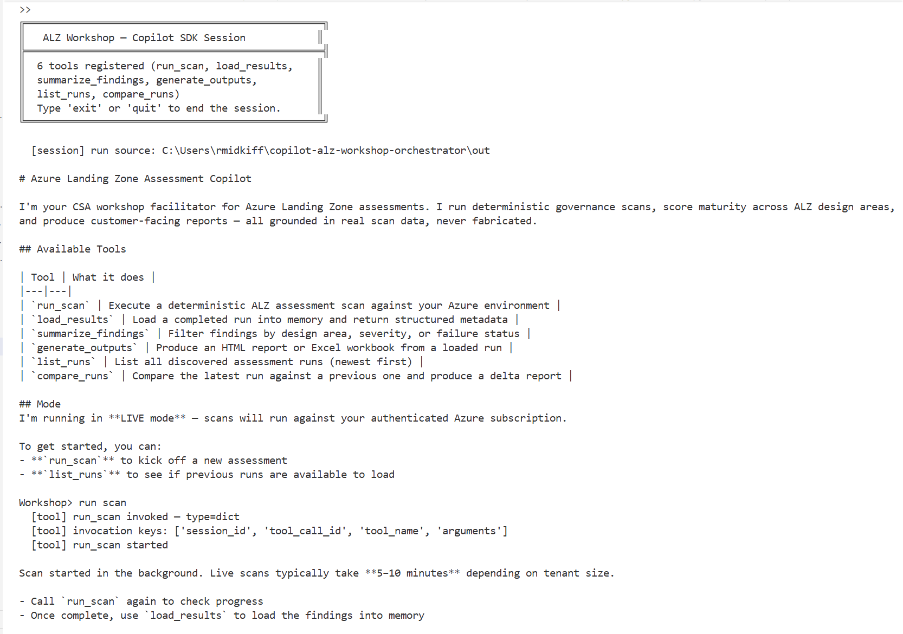

---

## Deterministic Assessment Outputs

The following artifacts are generated from the authoritative governance engine after a run is completed.

---

### Platform Snapshot (Deterministic Output)

Maturity scoring across ALZ design areas with automation coverage and enterprise readiness indicators.

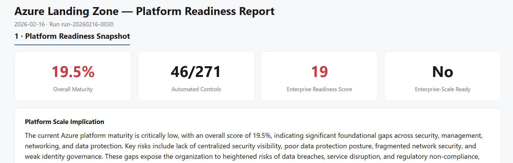

---

### Enterprise Readiness Blockers

Foundation gaps preventing enterprise-scale adoption — derived from failed controls and dependency graph impact.

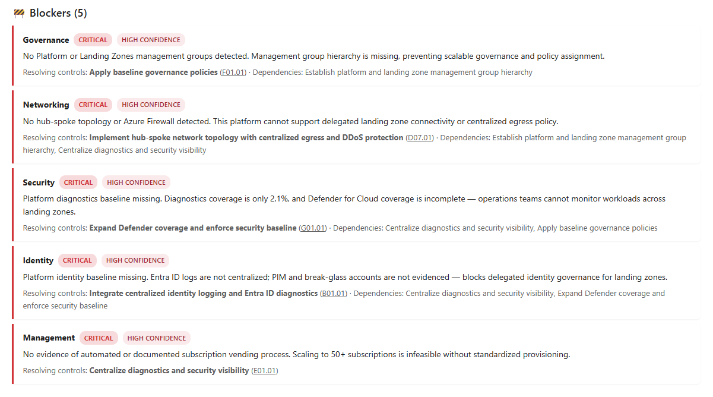

---

### Business Risk Prioritization

Deterministically ranked risks with root cause mapping and score drivers.

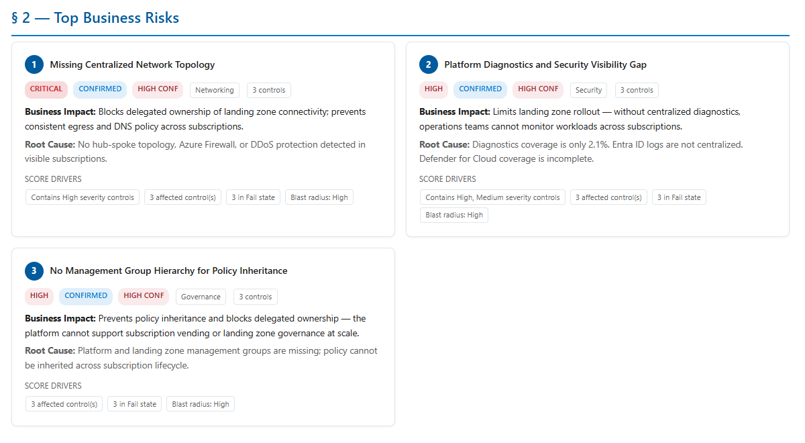

---

### 30-60-90 Transformation Roadmap

Dependency-ordered remediation initiatives with maturity trajectory projections.

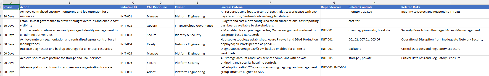

---

### Design Area Breakdown

ALZ design area maturity distribution with automation %, critical failures, and control state mapping.

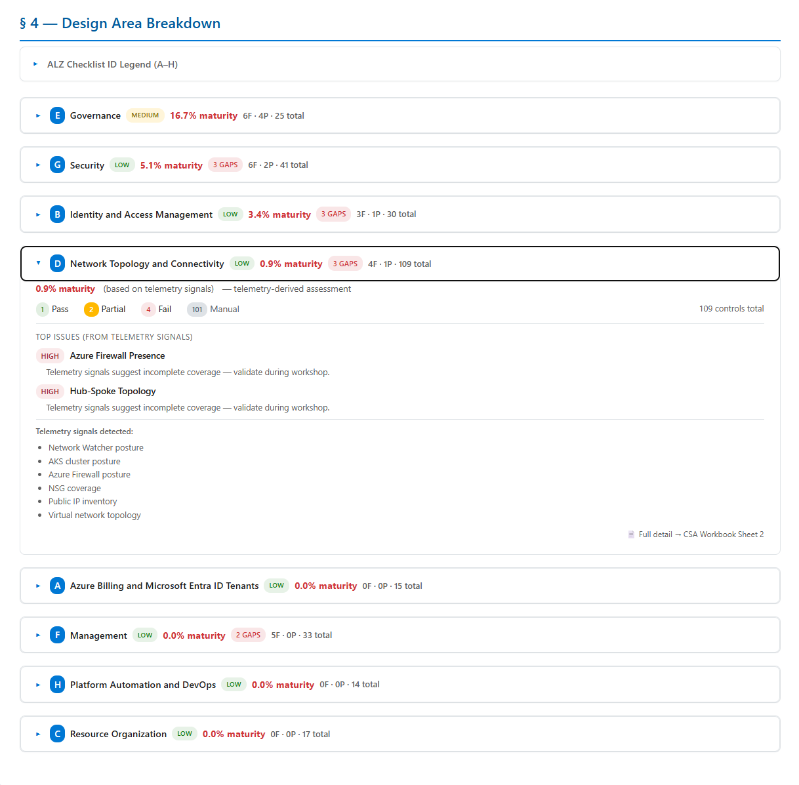

---

### Workshop Decision Funnel

CSA decision framing: blockers → risks → remediation path.

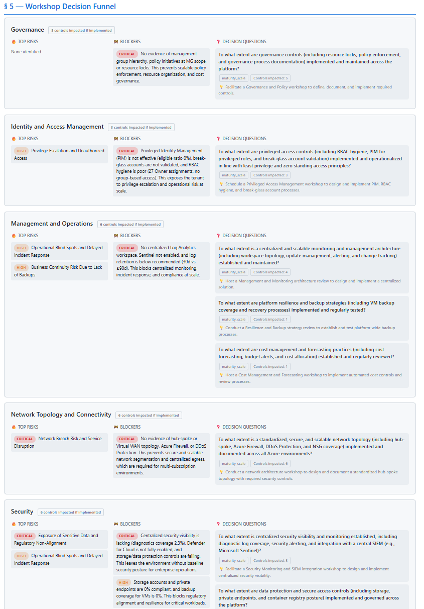

---

### CSA Workbook – 30-60-90 Plan

Customer-ready Excel roadmap aligned to checklist IDs and ownership.

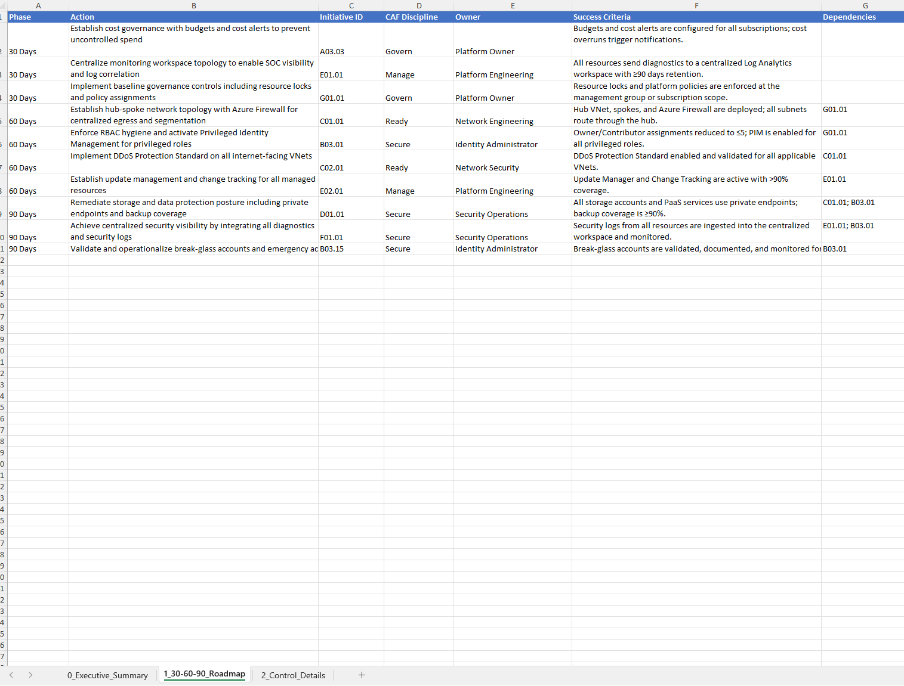

---

### CSA Workbook – Executive Summary

Executive framing with top risks and maturity metrics.

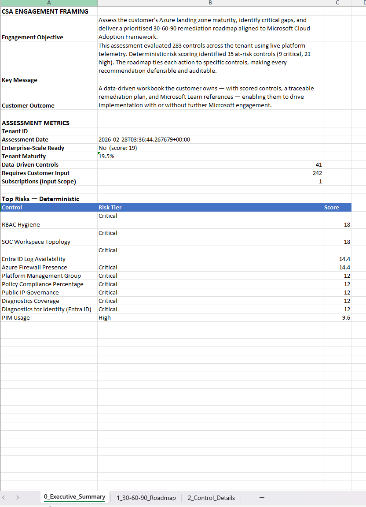

---

### Full Checklist Control Details

Control-level scoring mapped directly to official Azure Review Checklist IDs.

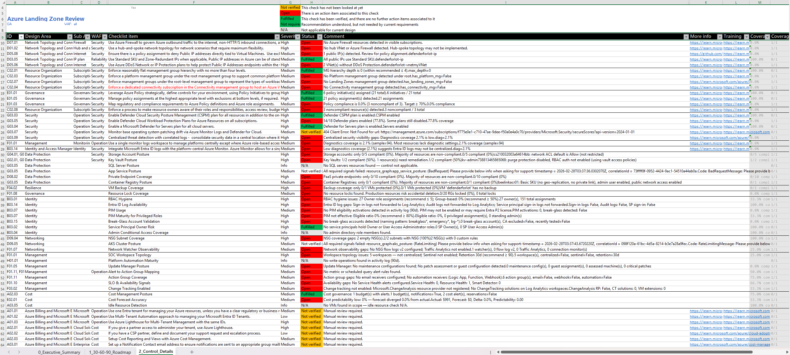

---

### Execution Context (Read-Only Azure Telemetry)

Assessment scope, evaluated subscriptions, and RBAC posture confirmation.

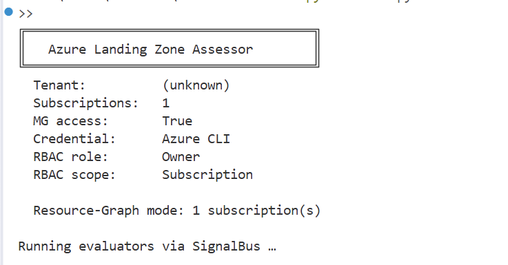

## Architectural Characteristics

| Principle | Implementation |
|------------|----------------|
| **Deterministic First** | All scoring, risk tiers, and control verdicts are computed from live Azure signals before AI executes |
| **Checklist-Grounded** | Every remediation item maps to an official Azure Review Checklist ID — no synthetic identifiers |
| **One-Way Data Flow** | AI consumes scored results but cannot modify deterministic outputs |
| **Schema-Enforced Output** | All AI responses are validated against JSON schemas before acceptance |
| **Documentation-Grounded** | Microsoft Learn MCP integration enriches outputs with official implementation guidance |
| **Traceable Deliverables** | CSA Workbook, HTML Report, and Run JSON preserve referential integrity end-to-end |


---

## End-to-End Reasoning Architecture

> **Architecture Principle — One-Way Data Flow**
>
> Deterministic assessment **feeds** the AI reasoning layer. Control verdicts and risk scores are final before AI executes.

```
                                        ┌───────────────────────────┐
                                        │   Copilot SDK Session     │
                                        │  (--workshop-copilot)     │
              CSA / User ◄─────────────►│                           │
          (multi-turn conversation)     │  6 Guardrailed Tools:     │
                                        │   run_scan                │
                                        │   load_results            │
                                        │   summarize_findings      │
                                        │   generate_outputs        │
                                        │   list_runs               │
                                        │   compare_runs            │
                                        │                           │
                                        │  Session Cache · Path &   │
                                        │  Format Guardrails        │
                                        └─────────┬─────────────────┘
                                                  │ invokes
                                                  ▼
Azure Tenant / Demo ──────────────► Deterministic ALZ Assessment
                                    (Resource Graph + Policy + Defender)
                                                  │
                                                  ▼
                                        Control Scoring Engine
                                                  │
                                    ┌─────────────┼──── one-way feed ───┐
                                    │             │                     ▼
                                    │             │           AI Reasoning Engine
                                    │             │                     │
                                    │             │                     ▼
                                    │             │             MCP Grounding Layer
                                    │             │    (Microsoft Learn retrieval)
                                    │             │                     │
                                    │             │                     ▼
                                    │             │             WHY Reasoning Layer
                                    │             │                     │
                                    │             └─────────────────────┘
                                    │                         │
                                    ▼                         ▼
                              Traceable Deliverables
                    (HTML Report · CSA Workbook · Run JSON)
```

### Copilot SDK Layer

The **Copilot SDK session** (`--workshop-copilot`) adds an interactive orchestration layer on top of the deterministic engine. It does **not** replace any of the pipeline above — it exposes it through a conversational interface with strict guardrails:

- **6 registered tools** — `run_scan`, `load_results`, `summarize_findings`, `generate_outputs`, `list_runs`, `compare_runs`
- **Session cache** — active run is remembered across turns; no re-loading required
- **Demo enforcement** — in demo mode, the fixture is always used regardless of model requests
- **Path confinement** — all file writes constrained to `out/`
- **Format allow-list** — only `html` and `excel` accepted
- **One-way data flow preserved** — Copilot consumes deterministic results but cannot modify scores or verdicts

### Data Collection

- Azure Resource Graph
- Policy + Compliance
- Defender for Cloud
- Management Group hierarchy

### Evaluation Engine

- Signal Bus routes platform telemetry → control evaluators
- ALZ control pack scoring → Pass / Fail / Partial / Manual
- Weighted maturity + risk model

### AI Reasoning Engine

| Pass | Name | Output |
|------|------|--------|
| 1 | **Roadmap & Initiatives** | 30-60-90 plan + initiative dependency graph |
| 2 | **Executive Briefing** | Top risks + maturity narrative |
| 3 | **Implementation Decision** | ALZ implementation pattern selection per initiative |
| 4 | **Sequence Justification** | Initiative ordering rationale + engagement recommendations |
| 5 | **Enterprise-Scale Readiness** | Readiness assessment against ALZ design areas |
| 6 | **Smart Questions** | Targeted discovery questions for the customer |
| 7 | **Implementation Backlog** | Per-initiative execution plans |
| 8 | **Microsoft Learn Grounding** | MCP SDK retrieval + ALZ-aware contextualisation |
| 9 | **Target Architecture** | Recommended architecture with execution units |
| 10 | **Critical Issues** | Top failing controls advisory with course of action |
| 11 | **Blocker Resolution** | Enterprise readiness blocker resolution summary |

### Why-Risk Agent (Deterministic Reasoning Layer)

- Failing controls → dependency graph impact
- Root cause → cascade effect
- Roadmap action that fixes it
- Microsoft Learn remediation reference

## Prerequisites

| Requirement | Details |
|---|---|
| **Python** | 3.12 or later |
| **Azure CLI** | Installed and authenticated (`az login`) |
| **Azure Permissions** | Reader role (minimum) on target subscriptions. Management Group Reader for full hierarchy visibility. |
| **Azure OpenAI** | Required for AI features. Needs a `gpt-4.1` deployment (or any chat-completion model). Set env vars (see [Configuration](#configuration)). |
| **Git** | For cloning the repository |

### Required Azure Resource Providers

The tool queries Azure Resource Graph and ARM APIs using **read-only** calls. The following resource providers must be registered on the target subscriptions for all signals to return data. Most are registered by default on any subscription that has used the service — but if a signal returns empty, missing provider registration is the most common cause.

| Resource Provider | Signal(s) | Registered by Default? |
|---|---|---|
| `Microsoft.ResourceGraph` | All Resource Graph queries | ✅ Yes |
| `Microsoft.Network` | Firewalls, VNets, Public IPs, NSGs, Route Tables, Private Endpoints, DDoS | ✅ Yes |
| `Microsoft.Storage` | Storage Account Posture | ✅ Yes |
| `Microsoft.KeyVault` | Key Vault Posture | ✅ Yes |
| `Microsoft.Sql` | SQL Server Posture | Only if SQL is used |
| `Microsoft.Web` | App Service Posture | Only if App Service is used |
| `Microsoft.ContainerRegistry` | Container Registry Posture | Only if ACR is used |
| `Microsoft.ContainerService` | AKS Cluster Posture | Only if AKS is used |
| `Microsoft.RecoveryServices` | VM Backup Coverage | Only if Backup is configured |
| `Microsoft.Compute` | VM inventory (for backup coverage) | ✅ Yes |
| `Microsoft.Security` | Defender plans, Secure Score | ✅ Yes |
| `Microsoft.Authorization` | RBAC hygiene, Resource Locks, Policy assignments | ✅ Yes (built-in) |
| `Microsoft.PolicyInsights` | Policy compliance summary | ✅ Yes |
| `Microsoft.Management` | Management Group hierarchy | ✅ Yes |
| `Microsoft.Insights` | Diagnostics coverage | ✅ Yes |

To check registration status:

```bash
az provider show -n Microsoft.RecoveryServices --query "registrationState" -o tsv
```

To register a missing provider (requires Contributor or Owner):

```bash
az provider register -n Microsoft.RecoveryServices
```

> **Note:** If a resource type doesn't exist in the subscription (e.g., no AKS clusters), the evaluator returns **NotApplicable** — not an error. Missing provider registration only matters when you *have* those resources but the signal returns empty.

---

## Quick Start

### 1. Clone the repository

```bash
git clone https://github.com/rebmid/Copilot-alz-workshop-orchestrator.git
cd Copilot-alz-workshop-orchestrator
```

### 2. Create a virtual environment

**Windows (PowerShell):**
```powershell
python -m venv .venv
.\.venv\Scripts\Activate.ps1
```

**macOS / Linux:**
```bash
python3 -m venv .venv
source .venv/bin/activate
```

### 3. Install dependencies

```bash
pip install -r requirements.txt
```

### 4. Configure environment variables

Create a `.env` file in the project root (this file is git-ignored):

```env
AZURE_OPENAI_ENDPOINT=https://<your-resource>.openai.azure.com/
AZURE_OPENAI_KEY=<your-api-key>
```

The tool expects a **`gpt-4.1`** deployment (or any chat-completion model) on the Azure OpenAI resource. See [Configuration](#configuration) for details.

> **Without these credentials**, the assessment still runs — all deterministic scoring, control evaluation, and data collection work normally. However, the 11-pass AI reasoning pipeline will be skipped (`⚠ AI skipped`), meaning these report sections will be empty:
> - 30-60-90 Transformation Roadmap
> - Executive Briefing & Top Business Risks
> - Enterprise-Scale Readiness & Blockers
> - Critical Issues & Course of Action
> - Workshop Decision Funnel smart questions
> - Microsoft Learn MCP grounding
>
> Use `--no-ai` to explicitly skip AI, or omit the `.env` file to skip silently.

### 5. Authenticate with Azure

```bash
az login
```

> For enterprise / multi-tenant engagements, see the **[CSA Mode](#csa-mode-enterprise-landing-zone-assessment)** workflow below — it covers tenant targeting, subscription scoping, and management-group selection.

### 6. Run the assessment

```bash
python scan.py                       # scans the default subscription
python scan.py --demo                # demo mode — no Azure connection
python scan.py --mg-scope <mg-id>    # scope to a management group (recommended for CSA)
```

See the **[CLI Reference](#cli-reference)** for all available modes and flags.

The tool will:

1. Discover your Azure execution context (tenant, subscriptions, identity)
2. Fetch the latest ALZ checklist from GitHub (~255 controls)
3. Run all evaluators against your environment
4. Score every control with weighted domain scoring
5. Run the 11-pass AI reasoning pipeline (requires `.env` — see step 4)
6. Ground recommendations in Microsoft Learn documentation via MCP
7. Output all artifacts to the `out/` directory

---

## Configuration

### Environment Variables

| Variable | Required | Description |
|---|---|---|
| `AZURE_OPENAI_ENDPOINT` | For AI features | Your Azure OpenAI resource endpoint URL (e.g. `https://myresource.openai.azure.com/`) |
| `AZURE_OPENAI_KEY` | For AI features | API key for the Azure OpenAI resource |
| `GITHUB_TOKEN` | For Copilot Workshop | Personal access token — alternatively, authenticate via `gh auth login` |

All variables can be set in a `.env` file in the project root (loaded automatically via `python-dotenv`) or as system environment variables.

### Azure OpenAI Model

The tool defaults to the **`gpt-4.1`** deployment name. To use a different model, modify the `AOAIClient` initialization in `ai/engine/aoai_client.py`.

### API Version

Default: `2024-02-15-preview`. Configurable in `AOAIClient.__init__()`.

## CLI Reference

### Demo Mode (No Azure Required)

```bash
python scan.py --demo                    # Demo mode — no Azure connection
```

Launch Copilot workshop (demo data):

```bash
python scan.py --workshop-copilot --demo
```

Launch Copilot workshop (live Azure environment):

```bash
python scan.py --workshop-copilot
```

---

### CSA Mode (Enterprise Landing Zone Assessment)

> **Recommended enterprise workflow** — scope to the customer's landing zone management group for a focused, performant assessment.

#### Step 1 — Authenticate to the Customer Tenant

```bash
az login --tenant <customer-tenant-id>
```

(Optional sanity check)

```bash
az account show --output table
```

Confirm:
- Correct tenant
- Correct subscription context

#### Step 2 — Scope to the Landing Zone Management Group

> Avoid `--tenant-wide` for enterprise tenants. Instead, scope to the landing zone management group for faster, targeted assessment.

```bash
python scan.py --mg-scope <landing-zone-mg-id>
```

#### Step 3 — Launch Workshop on the Completed Run

```bash
python scan.py --workshop-copilot --run-source out
```

Workshop mode reads the existing assessment results. No re-scan required — use `load_results` to pick up where the scan left off.

## Copilot Workshop Session

The workshop session provides an interactive, multi-turn Copilot experience with 6 guardrailed tools for running assessments, exploring findings, and generating customer-facing reports — all from a conversational interface.

> **Key principle:** Copilot orchestrates deterministic tools. It does not score controls, mutate the environment, or fabricate data. Every response is grounded in loaded assessment evidence.

### Demo Mode (no Azure connection required)

```bash
python scan.py --workshop-copilot --demo
```

Uses the bundled demo fixture (`demo/demo_run.json`) — no Azure credentials or Azure OpenAI needed. The demo fixture includes pre-computed AI output, so report sections like the roadmap and executive briefing are populated. Great for testing, demos, and learning the workflow.

> **Note:** Demo mode loads a static fixture. It does **not** run evaluators, the AI pipeline, or MCP grounding. To get fresh AI-enriched output, use live mode with `.env` configured.

### Live Mode (real Azure environment)

```bash
python scan.py --workshop-copilot
```

Runs against your authenticated Azure subscription. If `.env` is configured with Azure OpenAI credentials, the full 11-pass AI reasoning pipeline runs — otherwise AI is skipped and only deterministic scoring is produced.

> **Mode:** LIVE (authenticated against your Azure subscription)
>
> ⚠️ A full deterministic scan against a live tenant can take 5–10 minutes depending on tenant size and subscription count.
>
> **Best practice:** Run `run_scan` before the workshop or during a break. Use `list_runs` + `load_results` during live facilitation.

### Prerequisites

- **GitHub token** — either set `GITHUB_TOKEN` env var or authenticate via `gh auth login`
- **Azure CLI** (live mode only) — `az login` and confirm the correct subscription with `az account show`
- **Azure OpenAI** (live mode, for AI features) — `.env` file with `AZURE_OPENAI_ENDPOINT` and `AZURE_OPENAI_KEY` (see [Configuration](#configuration))

### Debug Mode

To see all SDK events during a session (useful for troubleshooting):

```powershell
$env:WORKSHOP_DEBUG = "1"
python scan.py --workshop-copilot --demo
```

### Workshop Tools

The session registers exactly 6 tools. Copilot selects tools based on your natural language prompts:

| Tool | Description | Parameters | Example Prompt |
|---|---|---|---|
| `run_scan` | Execute a deterministic ALZ assessment scan (subprocess-isolated) | `scope` (MG ID), `subscription` (sub ID), `tag` (label) | *"run a scan"* |
| `load_results` | Load a completed run into memory and return structured metadata | `run_id` (default: `latest`) | *"load the latest results"* |
| `summarize_findings` | Filter findings by design area, severity, or failure status | `design_area`, `severity`, `failed_only`, `limit` | *"show critical Security findings"* |
| `generate_outputs` | Produce HTML report or Excel workbook from a loaded run | `formats` (`html`, `excel`) | *"generate an HTML report and Excel workbook"* |
| `list_runs` | List available assessment runs in the run store | *(none)* | *"list all runs"* |
| `compare_runs` | Compare two assessment runs and produce a delta summary | `run_id_a`, `run_id_b` | *"compare the baseline run with the latest"* |

### Session Behavior

- **Session cache:** After `run_scan` or `load_results`, the active run is remembered — subsequent tool calls default to it
- **Demo enforcement:** In demo mode, `run_scan` always uses the demo fixture regardless of what the model requests
- **Format allow-list:** Only `html` and `excel` are accepted by `generate_outputs`
- **Path confinement:** All output files are written to `out/` — writes outside that directory are rejected at the code level

### Typical Workshop Flow

1. **"run a scan"** — executes the assessment (instant in demo, 5–10 min live)
2. **"load results"** — loads the run into the session
3. **"summarize findings"** — explore findings by design area or severity
4. **"generate an HTML report"** — produce the customer-facing deliverable
5. **"list all runs"** — browse available assessment snapshots in the run store
6. **"compare baseline with latest"** — produce a delta summary between two runs

### Example Prompts

```
Workshop> run a scan
Workshop> load the latest results
Workshop> show me all critical failures in Security
Workshop> what design areas have the most failures?
Workshop> summarize the Networking findings
Workshop> generate an HTML report and Excel workbook
Workshop> show failed controls in Identity with severity High
Workshop> list all runs
Workshop> compare the baseline run with the latest
```

---

## Output Artifacts

All outputs are written to the `out/` directory:

| File | Description |
|---|---|
| `run-YYYYMMDD-HHMM.json` | Complete assessment data — controls, scores, AI output, delta, execution context |
| `ALZ-Platform-Readiness-Report-{run_id}-SNNN.html` | Interactive executive HTML report with score breakdowns and gap analysis |
| `run-YYYYMMDD-HHMM_CSA_Workbook.xlsm` | 3-sheet CSA deliverable workbook — macro-enabled (see [CSA Workbook Deep Dive](#csa-workbook-deep-dive)) |
| `target_architecture.json` | Target architecture recommendation — derived from scored controls and checklist alignment, with component recommendations and Learn references |
| `preflight.json` | *(preflight mode only)* Access probe results |

Additionally, `assessment.json` is written to the project root as a convenience copy.

---

## How It Works

### 1. Data Collection

The **collectors** module queries Azure APIs via Resource Graph, Defender, Policy, and Management Group endpoints to gather raw infrastructure data:

- **Resource Graph** — VNets, firewalls, public IPs, NSGs, route tables, storage accounts, Key Vaults, private endpoints, diagnostic settings, and more
- **Defender** — security score, coverage tier, recommendations
- **Policy** — policy definitions, assignments, and compliance state
- **Management Groups** — full hierarchy tree

All queries use `AzureCliCredential` — the same identity you authenticated with via `az login`.

### 2. Evaluation & Scoring

The **Signal Bus** architecture routes collected data through registered evaluators:

1. The ALZ checklist is fetched live from GitHub (~255 controls across Security, Networking, Governance, Identity, Data Protection, Resilience, Management, and Cost domains)
2. Each control is matched to an evaluator (or marked `Manual` if no automated check exists)
3. Evaluators emit `Pass`, `Fail`, `Partial`, or `Info` verdicts with evidence
4. The **scoring engine** applies domain weights and severity multipliers to produce a composite risk score
5. **Automation coverage** is calculated — typically 20-30% of controls have automated evidence, with the rest requiring customer conversation

### 3. AI Reasoning Engine

The AI layer is a **consumer** of the deterministic scoring output — it receives the scored controls, risk tiers, and evidence via `build_advisor_payload()` and produces advisory content. It never modifies or feeds back into deterministic verdicts.

When AI is enabled, a **multi-stage reasoning pipeline** runs against Azure OpenAI:

| Pass | Prompt | Output | max_tokens |
|---|---|---|---|
| 1 | `roadmap.txt` | 30-60-90 transformation roadmap + named initiatives | 8000 |
| 2 | `exec.txt` | Executive briefing with business risk narrative | 8000 |
| 3 | `implementation_decision.txt` | ALZ implementation pattern selection per initiative | 8000 |
| 4 | `sequence_justification.txt` | Initiative ordering rationale + engagement recommendations | 8000 |
| 5 | `readiness.txt` | Enterprise-scale landing zone technical readiness | 8000 |
| 6 | `smart_questions.txt` | Customer discovery questions per domain | 8000 |
| 7 | `implementation.txt` × N | Implementation backlog (one item per initiative) | 4000 |
| 8 | *(MCP grounding)* | Learn doc refs, code samples, full-page enrichment | — |
| 9 | `target_architecture.txt` | Target architecture + `grounding.txt` enrichment | 8000 |
| 10 | `critical_issues.txt` | Top failing controls advisory with course of action | 8000 |
| 11 | `blocker_resolution.txt` | Enterprise readiness blocker resolution summary | 8000 |

The `AOAIClient` includes built-in resilience:
- **JSON fence stripping** — removes markdown ````json```` wrappers from model output
- **Truncation repair** — closes dangling brackets and strings when output is cut off
- **Retry loop** — up to 2 retries on invalid JSON responses

### 4. Grounding via Microsoft Learn MCP

The tool uses the **official MCP Python SDK** (Streamable HTTP transport) to connect to Microsoft's documentation API at `https://learn.microsoft.com/api/mcp`. The MCP server is declared in both `mcp.json` (root) and `.vscode/mcp.json` for VS Code integration.

| MCP Tool | Purpose |
|---|---|
| `microsoft_docs_search` | Retrieves curated 500-token content chunks for each initiative |
| `microsoft_code_sample_search` | Fetches Bicep/Terraform code samples for infrastructure recommendations |
| `microsoft_docs_fetch` | Downloads full documentation pages as markdown for deep grounding |

**Resilience features** (implemented in `ai/mcp_retriever.py`):
- **REST fallback** — if MCP is unreachable, falls back to the public Learn search REST API (`https://learn.microsoft.com/api/search`)
- **Circuit breaker** — after 5 consecutive MCP failures, bypasses MCP for the remainder of the run
- **LRU cache** — deduplicates identical (tool, query) pairs within a single run
- **Bounded retry** — at most 1 retry for retryable errors (timeout, 429, 5xx) with jittered backoff
- **ALZ design-area-aware queries** — every search is scoped to an official ALZ design area for authoritative results

Grounding runs for:
- Each initiative in the transformation roadmap
- Each identified gap
- The target architecture

### 5. Report Generation

**HTML Report** (`report.html`):
- **Platform Readiness Snapshot** — tenant maturity score, automation coverage, enterprise-scale landing zone technical readiness
- **Landing Zone Adoption Blockers** — AI-identified barriers to ALZ adoption
- **Platform Risk Prioritization** — 5-tier risk classification (Critical → Hygiene) with confidence indicators
- **Highest-Impact Remediation Sequence** — prioritised initiative roadmap
- **Maturity After Roadmap Execution** — projected score improvement
- **Capability Unlock View** — capabilities enabled by completing each initiative
- **Domain Deep Dive** — per-section control tables split into ALZ Core and Operational Overlay, with automation %, critical fail counts, and risk sorting
- **Assessment Scope & Confidence** — subscription coverage, signal availability, and data-collection provenance
- **Customer Validation Required** — controls needing manual review or customer conversation
- **ALZ Design Area References** — links to official ALZ design area documentation
- **Data Collection Provenance** — collector execution metadata and timestamps

**CSA Workbook** (`{run_id}_CSA_Workbook.xlsm`):
- See [CSA Workbook Deep Dive](#csa-workbook-deep-dive) below

---

## CSA Workbook Deep Dive

The workbook is the primary **customer-facing deliverable** — a 3-sheet Excel file ready for CSA engagements:

### Sheet 0: `0_Executive_Summary`

| Section | Content |
|---|---|
| **CSA Engagement Framing** | Engagement Objective, Key Message, Customer Outcome — ready-made talking points |
| **Assessment Metrics** | Total controls, automated %, pass/fail/partial counts, risk score |
| **Top Business Risks** | AI-identified risks with severity, affected domain, and recommended mitigation |

### Sheet 1: `1_30-60-90_Roadmap`

A phased transformation plan where each action item includes:

- **Phase** (30 / 60 / 90 day)
- **Action** and **Checklist ID** (canonical ALZ checklist ID, e.g. `A01.01`)
- **CAF Discipline** alignment
- **Owner** and **Success Criteria**
- **Dependencies**
- **Related Controls** — mapped from `checklist_id` → item controls (GUIDs) → checklist IDs
- **Related Risks** — reverse-mapped through `top_business_risks[].affected_controls`

### Sheet 2: `2_Control_Details`

All ~255 controls in a flat table with 19 columns:

| Column | Description |
|---|---|
| A: Control ID | Checklist GUID (shortened) |
| B: Section | ALZ domain (Security, Networking, …) |
| C: Severity | Critical / High / Medium / Low |
| D: Status | Pass / Fail / Partial / Manual |
| E: Text | Original checklist text |
| F: Notes | Evidence notes from evaluator |
| G: Evidence Count | Number of evidence items |
| H: Learn URL | Microsoft Learn documentation link |
| I: Training URL | Microsoft training link |
| J: Checklist Name | Control name from ALZ checklist |
| K: Checklist Description | Full description from ALZ checklist |
| L: WAF Pillar | Well-Architected Framework alignment |
| M: Grounded Summary | AI-enriched summary with Learn references |
| N: Grounded URL | Learn documentation URL from MCP |
| O: Grounded Code | Bicep/Terraform code sample from MCP |
| P: Grounded Fetch | Full-page markdown excerpt |
| Q: Related Items | Checklist IDs of related remediation items |
| R: Category | ALZ category |
| S: Discussion Points | Customer discovery items mapped by control |

---

## Why-Risk Reasoning (`--why`)

After a full assessment, drill into **why** a specific domain was flagged as the top risk:

```bash
python scan.py --why Networking --demo
```

This runs a **6-step causal reasoning pipeline** over the existing assessment data:

| Step | What it does |
|---|---|
| 1. **Find risk** | Matches the domain to a top business risk from the executive summary |
| 2. **Failing controls** | Extracts every Fail/Partial control tied to the risk |
| 3. **Dependency impact** | Queries the knowledge graph for downstream controls blocked by failures |
| 4. **Roadmap initiatives** | Finds transformation plan actions that address the affected controls |
| 5. **Learn grounding** | Attaches Microsoft Learn references to each initiative via MCP |
| 6. **AI causal explanation** | Sends the assembled evidence to the reasoning model for root-cause analysis |

The AI output includes:
- **Root cause** — why the domain is the top risk (current-state framing)
- **Business impact** — specific consequences tied to the evidence
- **Fix sequence** — ordered remediation steps with dependency rationale and Learn URLs
- **Cascade effect** — which downstream controls will automatically improve

Output is saved to `out/why-{domain}.json`. Use `--no-ai` to get the raw evidence payload without the AI narration.

---

## Preflight Mode

Before running a full assessment, validate your Azure permissions:

```bash
python scan.py --preflight
```

Preflight probes check:
- Subscription visibility
- Resource Graph query access
- Management group read access
- Defender API access
- Policy read access

Results are saved to `out/preflight.json` and printed to the console with pass/fail indicators.

---

## Scoring Model

### Domain Weights

| Domain | Weight | Rationale |
|---|---|---|
| Security | 1.5× | Highest impact on breach risk |
| Networking | 1.4× | Network segmentation is foundational |
| Identity | 1.4× | Identity is the new perimeter |
| Governance | 1.3× | Policy enforcement and compliance |
| Data Protection | 1.3× | Encryption, key management, data sovereignty |
| Resilience | 1.2× | Backup, disaster recovery, availability |
| Management | 1.1× | Operational visibility |
| Cost | 1.0× | Cost governance and optimization |

### Severity Weights

| Severity | Points |
|---|---|
| Critical | 6 |
| High | 5 |
| Medium | 3 |
| Low | 1 |
| Info | 0 |

### Status Multipliers

| Status | Multiplier | Meaning |
|---|---|---|
| Fail | 1.0× | Full risk weight applied |
| Partial | 0.6× | Reduced weight — some mitigation in place |
| Pass | 0× | No risk contribution |
| Manual | 0× | Not scored — requires customer discussion |

**Composite risk score** = Σ (severity_weight × status_multiplier × domain_weight) for all controls

---

## Troubleshooting

| Problem | Solution |
|---|---|
| `AZURE_OPENAI_KEY / AZURE_OPENAI_ENDPOINT not set` | Create a `.env` file with your Azure OpenAI credentials (see [Quick Start step 4](#4-configure-environment-variables)), or run with `--no-ai` to skip AI |
| Report sections are empty (roadmap, executive briefing, critical issues) | AI credentials are not configured. Create a `.env` file — without it, the 11-pass AI pipeline is silently skipped |
| `No subscriptions found` | Ensure `az login` succeeded and your identity has Reader on at least one subscription |
| `Management group hierarchy not visible` | Your identity needs Management Group Reader — the tool still works, but MG-related controls will be `Manual` |
| `Unterminated string` / JSON parse errors in AI output | The tool auto-repairs truncated JSON. If it persists, check your Azure OpenAI quota and model deployment name (`gpt-4.1`) |
| `MCP connection failed` | The tool falls back to the public Learn search API automatically. No action needed. |
| `ModuleNotFoundError` | Ensure your virtual environment is activated and `pip install -r requirements.txt` completed successfully |
| `az: command not found` | Install the [Azure CLI](https://learn.microsoft.com/en-us/cli/azure/install-azure-cli) |
| Slow execution | Large tenants take longer. Use `--tenant-wide` only when needed. AI passes add ~60-90s. |
| Workshop session: `GITHUB_TOKEN` errors | Set `GITHUB_TOKEN` env var with a personal access token, or run `gh auth login` |

## Deployment

This tool is designed to run **locally** on a CSA's workstation — it is not a hosted service.

### Running in CI/CD

If you want to run assessments in a pipeline (e.g., scheduled governance scans):

```bash
# Authenticate with a service principal
az login --service-principal -u $APP_ID -p $SECRET --tenant $TENANT_ID

# Run assessment with no interactive prompts
python scan.py --no-ai --no-html
```

> **Note:** The Copilot workshop session (`--workshop-copilot`) requires an interactive terminal and a GitHub token — it is not suitable for headless/CI execution.

---

## Responsible AI

### Transparency

- **AI does not score controls.** All control verdicts (`Pass`, `Fail`, `Partial`, `Manual`) are computed deterministically from live Azure telemetry before AI executes. The AI reasoning engine is a **consumer** of scored evidence — it cannot modify or override deterministic results.
- **AI-generated content is clearly scoped.** The 11-pass reasoning pipeline produces advisory content (roadmaps, executive briefings, risk narratives). These outputs are labeled as AI-generated in the report and are always traceable to the underlying control evidence.
- **Microsoft Learn grounding.** Remediation recommendations are grounded in official Microsoft documentation via MCP retrieval — not synthesized from training data alone.

### Limitations

- **Automation coverage is partial.** Typically 20–30% of ALZ checklist controls have automated evaluators. The remaining controls are marked `Manual` and require customer conversation to resolve. The tool does not guess or infer results for manual controls.
- **AI reasoning depends on model quality.** The advisory output (roadmaps, risk narratives, smart questions) is generated by Azure OpenAI and may contain inaccuracies, incomplete reasoning, or hallucinated references — even with grounding. CSAs should review AI output before presenting to customers.
- **Point-in-time snapshot.** Assessment results reflect the Azure environment state at scan time. They do not represent continuous compliance and may become stale.
- **No multi-tenant isolation.** The tool runs under a single Azure identity. It does not enforce tenant boundaries — the operator is responsible for scoping access appropriately.

### Guardrails

| Guardrail | Enforcement |
|---|---|
| **No environment mutation** | All Azure API calls are read-only (Resource Graph queries, ARM GET, Policy read). No create/update/delete operations exist in the codebase. |
| **No scoring override** | Maturity scores are computed deterministically by the scoring engine. AI cannot alter control verdicts or weights. |
| **File confinement** | All generated artifacts are written to `out/`. The `ensure_out_path()` function rejects any path outside that directory. |
| **Format allow-list** | `generate_outputs` only accepts `html` and `excel` — arbitrary file formats are rejected. |
| **Schema validation** | AI responses are validated against JSON schemas before acceptance. Malformed output is rejected and retried. |
| **One-way data flow** | Deterministic results feed the AI layer. AI output never feeds back into the scoring engine. |
| **No data fabrication** | Every Copilot workshop response must be grounded in loaded assessment data. The session has no access to external data sources beyond what the tools provide. |

### Data Handling

- **No customer data is transmitted externally** metadata goes to Azure OpenAI (for AI reasoning) and Microsoft Learn (for documentation grounding). Both are Microsoft services.
- **No telemetry or usage data** is collected by this tool.
- **Assessment results** (including Azure resource metadata) are stored locally in `out/` and `assessment.json`

---

## Built with AI Assistance

This project was developed using GitHub Copilot as an AI pair programmer for code generation, refactoring, and test scaffolding.  
All architecture, control logic, Azure integration, and reasoning workflows were designed and implemented by the author.

## License

Copyright (c) 2026 Rebekah Midkiff